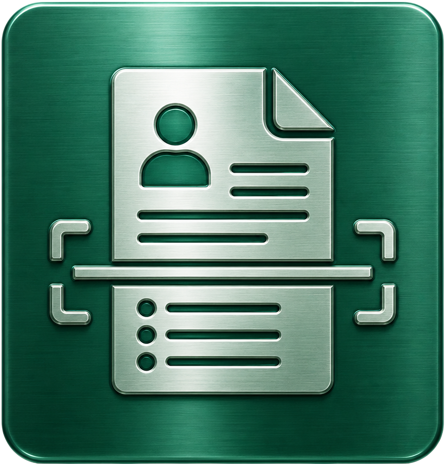
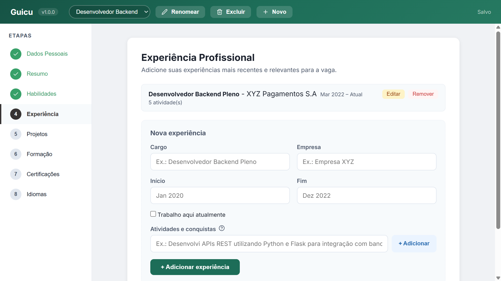
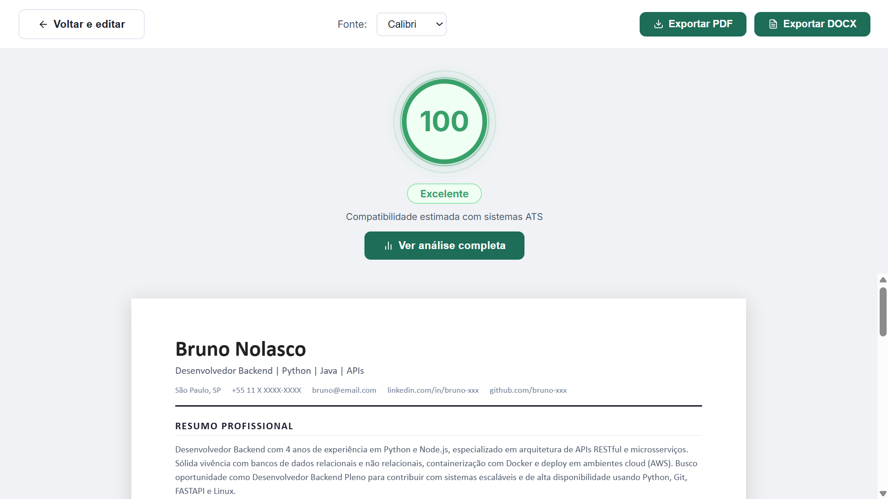
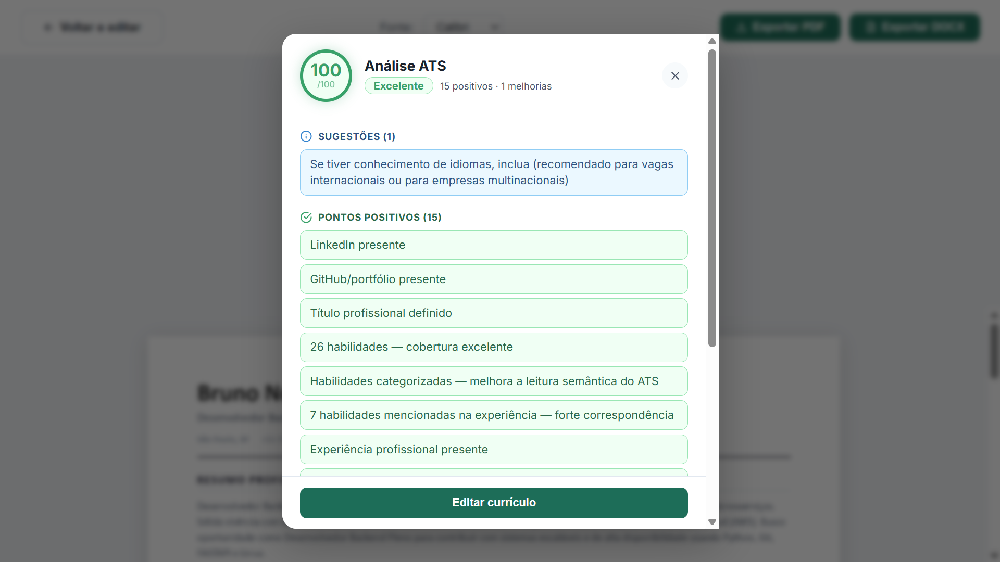

[Português](README.md) | English

<p align="center">
    
</p>

<h1 align="center">
    Guicu
</h1>

<p align="center">
    <a href="https://github.com/carvalho-jefferson/guicu/blob/main/LICENSE">
        
    </a>
</p>

<p align="center">
    Create, edit, analyze and export resumes offline, with full security and privacy.
</p>

## Description

Guicu is a resume builder focused on compatibility with ATS (Applicant Tracking System) — the software used by most companies to automatically filter candidates before any human review.

This project prioritizes what actually gets you past the first filter: keyword density, document structure, parser compatibility, and section completeness.

❇️ [Download: Windows, macOS and Linux](https://github.com/carvalho-jefferson/guicu/releases/latest)

> Windows users: during installation, Windows may display a SmartScreen warning. Click "More info" and then "Run anyway". This happens because the app does not yet have a digital certificate.

## Features

- Resources fully optimized for ATS analysis: fonts, formatting, and more
- Resume score based on [real criteria](#ats-optimization) used by ATS platforms for parsing and candidate ranking
- Step-by-step guided resume creation across all sections
- Export to PDF and DOCX
- Automatic dark mode based on system preference
- Auto-save with local JSON storage
- Multiple resume management
- Fully offline — your data protected, you in control of everything

## Screenshots

<p align="center">
  
  
  
</p>

## ATS Optimization

| Criterion                           | Weight |
| ----------------------------------- | ------ |
| Skills and keyword coverage         | 35 pts |
| Work experience                     | 25 pts |
| Contact information                 | 12 pts |
| Professional summary with keywords  | 10 pts |
| Education                           | 5 pts  |
| Certifications                      | 5 pts  |
| Job title                           | 5 pts  |
| Projects                            | 3 pts  |

## How to run

```bash
git clone https://github.com/carvalho-jefferson/guicu.git
cd guicu
npm install
npm run dev
```

<details>
<summary>To generate an installer</summary>

```bash
npm run build:win    # Windows
npm run build:mac    # macOS
npm run build:linux  # Linux
```

</details>

## Why use Guicu?

Free resume builders often lock useful features behind subscriptions, optimize for visual design at the expense of ATS compatibility, or may even share and sell your personal data to third parties. In this context, Guicu becomes something truly useful and necessary: a practical, secure, offline and open-source tool for those who need their resume to pass automated screening and significantly increase their chances of landing the desired job.

## License

AGPL-3.0 License. See [LICENSE](LICENSE) for more details.

## Author

Jefferson Carvalho

[GitHub](https://github.com/carvalho-jefferson) | [LinkedIn](https://www.linkedin.com/in/1jefferson-carvalho/)

> *This project is evolving. Feedback, suggestions and contributions are welcome!*
