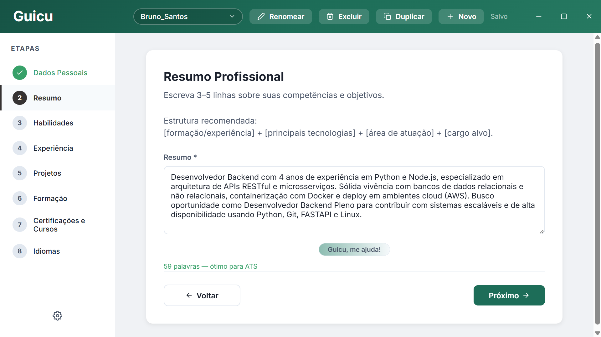
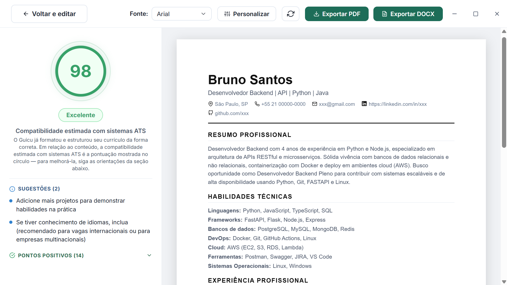

[Português](README.md) • English

<p align="center">
    
</p>

<h1 align="center">
    <a id="top"></a>
    Guicu
</h1>

<p align="center">
    Create, edit, analyze, and export resumes offline, with full security and privacy.
</p>

<p align="center">
    <a href="https://github.com/carvalho-jefferson/guicu/blob/main/LICENSE">
        
    </a>
    
    
    <a href="https://github.com/carvalho-jefferson/guicu/releases">
        
    </a>
</p>

<p align="center">
    <a href="https://github.com/carvalho-jefferson/guicu/releases/latest">
        
    </a>
</p>

Guicu is a resume builder focused on compatibility with ATS (Applicant Tracking System) software — the systems used by most companies to automatically filter candidates before any human review.

This project prioritizes what actually gets you past the first filter: keyword density, document structure, parser compatibility, and section completeness.

> Notice for Windows users: during installation, Windows may show a SmartScreen warning. Click "More info" and then "Run anyway." This happens because the program doesn't have a digital certificate yet.

## Features

- Fully optimized resources for ATS parsing: fonts, formatting, and more
- Resume scoring based on [real criteria](#ats-optimization) used by ATS platforms for parsing and ranking candidates
- Step-by-step guided resume creation across all sections
- Export to PDF and DOCX
- Automatic dark mode based on your operating system's preference
- Auto-save with local storage in JSON
- Manage multiple resumes
- Fully offline, with no reliance on servers or an internet connection
- Privacy by design: your information never leaves your computer

## Screenshots

<p align="center">
  
  
</p>

## ATS Optimization

| Criteria                          | Weight |
| ---------------------------------- | ------ |
| Skills and keyword coverage        | 35 pts |
| Work experience                    | 25 pts |
| Contact information                | 12 pts |
| Professional summary with keywords | 10 pts |
| Education                          | 5 pts  |
| Certifications                     | 5 pts  |
| Professional title                 | 5 pts  |
| Projects                           | 3 pts  |

## How to run

```bash
git clone https://github.com/carvalho-jefferson/guicu.git
cd guicu
npm install
npm run dev
```

<details>
<summary>To generate an installer</summary>

```bash
npm run build:win    # Windows
npm run build:mac    # macOS
npm run build:linux  # Linux
```

</details>

## Why use Guicu?

Free resume builders often lock useful features behind subscriptions, optimize for visual design at the expense of ATS compatibility, or even share/sell your personal data to other companies. Guicu was built to be a genuinely useful alternative: a practical, secure, offline, and open-source tool for anyone who needs their resume to pass automated screening and land more interviews.

## License

AGPL-3.0 License. See [LICENSE](LICENSE) for details.

<p align="center">
    Made by Jefferson Carvalho
</p>

<p align="center">
  <a href="https://github.com/carvalho-jefferson">GitHub</a> •
  <a href="https://www.linkedin.com/in/1jefferson-carvalho/">LinkedIn</a>
</p>

<p align="center">
  <a href="#top">Back to top</a>
</p>